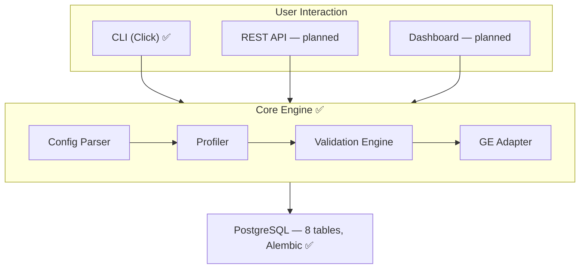

# DataNexus

**Automated Data Quality & Observability Framework** — a DEPI 2026 graduation project.

DataNexus profiles datasets, runs configurable validation rules against them, scores
the result on a 0–100 quality scale, and persists every run so quality can be tracked
over time. It's built as a set of small, isolated modules (profiler, config parser,
validation engine, GE adapter) sitting on top of a PostgreSQL metadata store —
designed so each piece can be developed, tested, and reasoned about independently.

> 📍 **Status:** core engine + CLI are functional end-to-end against a real database.
> See [Project Status](#project-status) below for exactly what's built vs. planned.

---

## What it does

1. **Profile** a dataset — row counts, null %, distinct counts, min/max/mean, pattern
   detection (emails, etc.)
2. **Validate** it against a YAML config of checks (`not_null`, `range`, `unique`,
   `in_set`, `regex`, `foreign_key`, `freshness`, ...)
3. **Score** the run from 0–100, weighted by check severity (critical=1.0, high=0.75,
   medium=0.5, low=0.25)
4. **Persist** every run, every per-check result, and the dataset profile, so history
   is queryable later

All of this is reachable today through a CLI tool — no servers, no extra setup beyond
a Postgres database.

---

## Quick start

```bash
# 1. Clone & enter
git clone <repo-url> && cd datanexus

# 2. Virtual environment
python -m venv venv
source venv/bin/activate        # Windows: venv\Scripts\activate

# 3. Install dependencies
pip install -r requirements.txt
pip install -e .                # registers the `datanexus` CLI command

# 4. Configure environment
cp .env.example .env             # fill in your Postgres credentials

# 5. Apply the database schema
alembic upgrade head

# 6. Seed demo data (creates a sample CSV + DB rows with deliberate quality issues)
datanexus seed

# 7. Run it
datanexus config list
datanexus run <config-id>
datanexus runs list
datanexus runs show <run-id>
```

### CLI command reference

| Command | What it does |
|---|---|
| `datanexus seed [--reset]` | Seeds a demo data source, dataset, and two validation configs |
| `datanexus config list / show / generate` | Browse or scaffold validation configs |
| `datanexus run <config-id>` | Executes a validation run, prints live per-check progress + quality score |
| `datanexus profile <dataset-id>` | Runs the profiler on a dataset, prints column statistics |
| `datanexus runs list / show <run-id>` | Browse run history and per-check results |
| `datanexus sources list` | List registered data sources |
| `datanexus datasets list` | List registered datasets |

Every command above is real — none of it is mocked or hardcoded.

---

## Architecture



Full design rationale, ERD, and behavioral diagrams (sequence/state machine/use-case)
are in [`docs/system design/`](docs/system%20design/).

### Database schema

8 tables, managed by Alembic migrations:

| Table | Purpose |
|---|---|
| `data_sources` | Where data comes from (DB connection / CSV path) |
| `datasets` | A specific table or file under validation |
| `data_profiles` | Statistical snapshot of a dataset at a point in time |
| `validation_configs` | YAML rule sets, one per dataset |
| `test_definitions` | Reusable named check templates |
| `validation_runs` | One execution of a config — status, quality score |
| `validation_results` | Per-check outcome of a run |
| `alerts` | Dispatched notifications (schema ready, dispatch logic pending) |

### Validation config example

```yaml
dataset: your_table_name
name: My Validation Config
quality_threshold: 80.0
alert_channels: []   # [slack, email] — once Alert Manager ships

checks:
  - name: email_not_empty
    column: email
    check_type: not_empty
    threshold: 0.95
    severity: high

  - name: age_in_range
    column: age
    check_type: range
    min_value: 18
    max_value: 120
    threshold: 1.0
    severity: medium
```

Supported `check_type` values: `not_null`, `completeness`, `not_empty`, `unique`,
`range`, `regex`, `in_set`, `foreign_key`, `referential_integrity`, `freshness`.

---

## Project status

This is a transparent, honest snapshot — including what's *not* built yet — rather
than an idealized roadmap.

### ✅ Built and working

- PostgreSQL schema (8 tables) + Alembic migrations
- Config Parser (YAML loading + validation)
- Data Profiler (column statistics, pattern detection)
- Validation Engine (check execution, severity-weighted quality scoring)
- Great Expectations Adapter (single-file wrapper, documented in
  [`src/ge_adapter/README.md`](src/ge_adapter/README.md))
- CLI tool (Click) — seed, run, profile, config, runs, sources, datasets
- Demo seed script with deliberately corrupted sample data

### 🔜 Designed, not yet implemented

- **Alert Manager** — Slack/email dispatch on failed runs (schema exists, table is
  `alerts`, logic not written)
- **REST API** (Flask) — not required by the CLI, which talks to the database
  directly; would matter for Airflow/CI integration later
- **Streamlit Dashboard** — quality score visualization, trend charts
- **Airflow DAG** — scheduled validation runs
- **Test suite** (pytest) — no automated tests yet
- **Docker Compose** — no containerization yet
- **CI/CD** (GitHub Actions) — no pipeline yet

The system design documents under `docs/system design/` describe the full target
architecture; this README reflects what's actually implemented today.

---

## Tech stack

Python 3 · PostgreSQL · SQLAlchemy + Alembic · pandas · PyYAML/Pydantic ·
Great Expectations · Click + Rich (CLI) · *(planned: Flask, Streamlit, Apache Airflow,
pytest, Docker, GitHub Actions)*

---

## Repository layout

```
datanexus/
├── src/
│   ├── database/        # SQLAlchemy models + connection
│   ├── profiler/         # Data Profiler
│   ├── config_parser/    # YAML config loading + validation
│   ├── validator/        # Validation Engine + scoring
│   ├── ge_adapter/        # Great Expectations wrapper
│   ├── cli/              # Click-based CLI (entry point)
│   ├── alert_manager/    # placeholder — Slack/email alerts
│   ├── api/               # placeholder — Flask REST API
│   └── dashboard/         # placeholder — Streamlit dashboard
├── migrations/            # Alembic migration scripts
├── config/examples/      # Sample validation YAML configs
├── scripts/seed.py        # Demo data seeder
├── docs/system design/    # Architecture, data model, behavioral diagrams
└── data/                  # Generated demo CSV (gitignored except sample)
```

---

## License

MIT — see [LICENSE](LICENSE).

---
*Graduation project for the Digital Egypt Pioneers Initiative (DEPI R4) MS Data Engineer Track, under the
Ministry of Communications and Information Technology (MCIT).*
